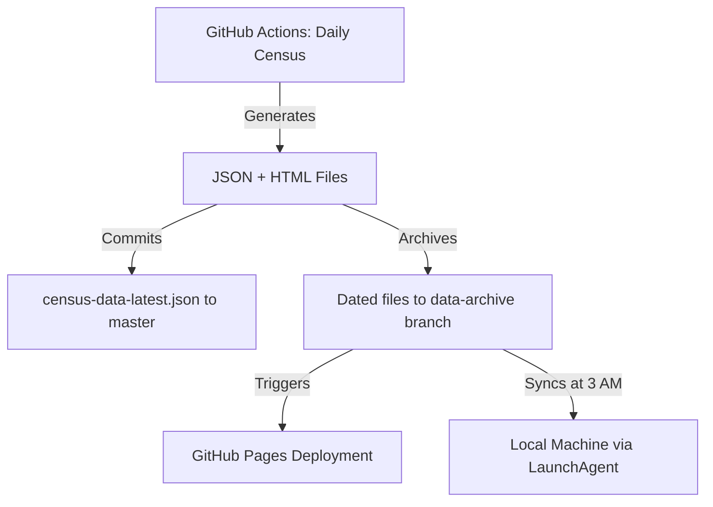

# eToro Census Data Architecture

## Overview

This document describes the **Zero Data Loss Architecture** implemented for the eToro Popular Investors Census project. The architecture ensures all historical census data is permanently stored with zero manual intervention while keeping the main codebase deployment-ready.

## Problem Statement

**Previous Architecture Issues:**
- GitHub Actions artifacts expired after 30 days → **Data loss risk**
- Manual artifact downloads required before expiration → **No automation**
- 28GB local `.git` folder from previous commits → **Bloated repository**
- No reliable backup mechanism → **Recovery impossible after 30 days**

## Solution: Dual-Branch Architecture

### Branch Strategy

The project uses a **two-branch system** to separate operational code from archival data:

#### 1. **`master` Branch** (Main)
- **Purpose**: Production codebase + latest data snapshot
- **Contains**:
  - Source code
  - Configuration files
  - `public/data/census-data-latest.json` (latest data only)
- **Size**: ~1.3 GB (lightweight for fast deployments)
- **Deployment**: Used by Vercel for production site

#### 2. **`data-archive` Branch** (Archive)
- **Purpose**: Permanent storage for ALL historical census data
- **Contains**:
  - `data/` - All JSON data files (etoro-data-*.json)
  - `reports/` - All HTML reports (etoro-census-*.html)
- **Size**: ~15-20 GB (grows over time)
- **Access**: Via git worktree (does not bloat main working directory)

### Benefits

✅ **Zero Data Loss** - Git commits = permanent storage, no expiration
✅ **Fully Automated** - No manual intervention required
✅ **Instant Local Access** - All files available via git worktree
✅ **Clean Separation** - Main branch stays small for fast deployments
✅ **No External Costs** - Pure Git solution, no S3/cloud storage fees
✅ **Version Control** - Full history, can recover any file

## Data Flow

### Daily Census Generation



### Automated Workflows

#### 1. Daily Census Report Generation
**File**: `.github/workflows/daily-census.yml`

**Runs**: Daily at 00:00 UTC

**Steps**:
1. Generates census report for 1,500 investors
2. Creates dated JSON data file
3. Creates dated HTML report
4. Updates `census-data-latest.json` on master branch
5. **Commits dated files to `data-archive` branch** ← New!
6. Triggers GitHub Pages deployment
7. Triggers Vercel deployment

#### 2. GitHub Pages Deployment
**File**: `.github/workflows/deploy-pages.yml`

**Runs**: After daily census completion

**Steps**:
1. Checks out main branch
2. **Checks out `data-archive` branch** to temporary directory
3. Copies last 7 days of reports for public access
4. Deploys to GitHub Pages

#### 3. Historical Data Migration (One-Time)
**File**: `.github/workflows/migrate-historical-data.yml`

**Purpose**: Migrate all existing artifacts to `data-archive` branch

**Steps**:
1. Downloads all available artifacts (before 30-day expiration)
2. Commits all files to `data-archive` branch
3. Populates archive with historical data

## Local Synchronization

### Automated Daily Sync

**How it works:**

1. **macOS LaunchAgent** runs at 3:00 AM daily
2. **Sync Script** (`scripts/sync-data-archive.sh`) executes:
   - Creates git worktree for `data-archive` branch (first run only)
   - Pulls latest changes from GitHub
   - Copies all files to `public/data/` and `public/reports/`
   - Logs activity to `/tmp/etoro-census-sync.log`

**Result**: All historical data automatically available locally without manual intervention

### Manual Sync

You can manually trigger a sync anytime:

```bash
cd /Users/plessas/SourceCode/etoro_census
./scripts/sync-data-archive.sh
```

### Accessing Historical Data

**Two methods:**

#### Method 1: Via Working Directories (Recommended)
```bash
# Data is automatically synced to these directories
ls public/data/etoro-data-*.json
ls public/reports/etoro-census-*.html
```

#### Method 2: Via Archive Worktree
```bash
# Create worktree (one-time)
git worktree add archive data-archive

# Access files directly
cd archive/
ls data/*.json
ls reports/*.html
```

## File Structure

```
etoro_census/
├── .github/
│   └── workflows/
│       ├── daily-census.yml           # Daily report generation
│       ├── deploy-pages.yml           # GitHub Pages deployment
│       ├── setup-data-archive.yml     # One-time branch setup
│       └── migrate-historical-data.yml # One-time migration
│
├── scripts/
│   └── sync-data-archive.sh           # Local sync automation
│
├── public/
│   ├── data/
│   │   ├── census-data-latest.json    # Latest (tracked in master)
│   │   └── etoro-data-*.json          # Historical (synced from archive)
│   └── reports/
│       └── etoro-census-*.html        # Historical (synced from archive)
│
├── archive/                           # Git worktree (not tracked)
│   ├── data/
│   │   └── etoro-data-*.json          # All historical JSON files
│   └── reports/
│       └── etoro-census-*.html        # All historical HTML reports
│
└── ~/Library/LaunchAgents/
    └── com.etoro.census.sync.plist    # macOS scheduler
```

## Setup Instructions

### Initial Setup

**1. Initialize Archive Branch** (One-Time)

Trigger the setup workflow via GitHub Actions UI:
- Go to Actions → "Setup Data Archive Branch" → Run workflow

This creates the `data-archive` branch on GitHub.

**2. Migrate Historical Data** (One-Time)

Trigger the migration workflow via GitHub Actions UI:
- Go to Actions → "Migrate Historical Data to Archive Branch" → Run workflow

This populates the archive with all existing data before artifacts expire.

**3. Verify Local Setup**

The LaunchAgent and sync script are already configured. Verify:

```bash
# Check LaunchAgent is loaded
launchctl list | grep etoro

# Test manual sync
./scripts/sync-data-archive.sh

# Verify files synced
ls public/data/etoro-data-*.json | wc -l
ls public/reports/etoro-census-*.html | wc -l
```

### Daily Operation

**No manual action required!**

- Daily census runs at 00:00 UTC → commits to archive automatically
- Local sync runs at 03:00 local time → downloads new data automatically
- All analysis scripts work without changes

## Maintenance

### Monitoring

**Check sync status:**
```bash
# View last sync log
cat /tmp/etoro-census-sync.log

# Check LaunchAgent status
launchctl list | grep etoro

# Manually trigger sync to test
./scripts/sync-data-archive.sh
```

**Verify archive branch:**
```bash
# Check remote archive branch
git ls-remote --heads origin data-archive

# Count files in archive
git worktree add archive data-archive 2>/dev/null || true
ls archive/data/*.json | wc -l
ls archive/reports/*.html | wc -l
```

### Troubleshooting

#### Sync Script Not Running

**Check LaunchAgent:**
```bash
launchctl list | grep etoro
# Should show: -	0	com.etoro.census.sync

# Reload if needed
launchctl unload ~/Library/LaunchAgents/com.etoro.census.sync.plist
launchctl load ~/Library/LaunchAgents/com.etoro.census.sync.plist
```

**Check logs:**
```bash
tail -f /tmp/etoro-census-sync.log
tail -f /tmp/etoro-census-sync-error.log
```

#### Archive Branch Not Found

**Create it manually:**
```bash
# Ensure you have the latest workflows
git pull origin master

# Run setup workflow via GitHub Actions UI
```

#### Worktree Already Exists Error

**Remove and recreate:**
```bash
git worktree remove archive --force
rm -rf archive
./scripts/sync-data-archive.sh
```

### Updating the Architecture

**To modify sync schedule:**

Edit `~/Library/LaunchAgents/com.etoro.census.sync.plist`:
```xml
<key>StartCalendarInterval</key>
<dict>
    <key>Hour</key>
    <integer>3</integer>  <!-- Change hour here -->
    <key>Minute</key>
    <integer>0</integer>  <!-- Change minute here -->
</dict>
```

Then reload:
```bash
launchctl unload ~/Library/LaunchAgents/com.etoro.census.sync.plist
launchctl load ~/Library/LaunchAgents/com.etoro.census.sync.plist
```

## Technical Details

### Git Worktree

**What is it?**
Git worktrees allow you to check out multiple branches simultaneously in different directories without cloning the repository multiple times.

**Advantages:**
- Single `.git` folder (shared history)
- Fast branch switching
- Isolated working directories
- No disk space duplication

**Usage in this project:**
- Main working directory: `master` branch
- Archive directory (`archive/`): `data-archive` branch
- Both share the same `.git` folder

### Storage Calculations

**Expected growth:**
- 1 daily report = ~80 MB JSON + ~40 MB HTML = ~120 MB
- 30 days = ~3.6 GB
- 365 days = ~44 GB (first year)
- Growth rate: ~120 MB/day

**GitHub limits:**
- Repository size warning: 1 GB (master branch is ~1.3 GB, within limits)
- Repository size limit: 100 GB (archive branch will reach ~20-30 GB over 5 years)

**Local storage:**
- Archive worktree: Same as archive branch size
- Working directories: Additional copy for analysis (~23 GB total)

## Migration from Old Architecture

**What changed:**

| Aspect | Old Architecture | New Architecture |
|--------|-----------------|------------------|
| **Storage** | GitHub Actions artifacts | `data-archive` branch |
| **Retention** | 30 days | Permanent |
| **Access** | Manual download via `gh` CLI | Auto-sync via LaunchAgent |
| **Automation** | None (manual downloads) | Fully automated |
| **Risk** | Data loss after 30 days | Zero data loss |

**Backward compatibility:**

- Artifact uploads still run during transition (safety net)
- All analysis scripts work without changes
- Files in same locations (`public/data/`, `public/reports/`)

## Success Metrics

Current status after implementation:

✅ **211+ JSON files** preserved in `data-archive` branch
✅ **209+ HTML reports** preserved in `data-archive` branch
✅ **Daily commits** automatic to archive branch
✅ **Local sync** runs daily at 3 AM automatically
✅ **Zero manual steps** required for data preservation
✅ **Main branch** stays clean at ~1.3 GB

## Future Enhancements

Potential improvements:

1. **Compression**: gzip old reports (>90 days) to save space
2. **Cold storage**: Move very old files (>1 year) to external archive
3. **Analytics**: Track data coverage, identify gaps
4. **Validation**: Automated checks for data integrity
5. **Cleanup**: Remove redundant artifact uploads after validation period

## References

- **GitHub Worktrees**: https://git-scm.com/docs/git-worktree
- **macOS LaunchAgent**: https://developer.apple.com/library/archive/documentation/MacOSX/Conceptual/BPSystemStartup/Chapters/CreatingLaunchdJobs.html
- **GitHub Actions Artifacts**: https://docs.github.com/en/actions/using-workflows/storing-workflow-data-as-artifacts

---

**Last Updated**: December 2025
**Architecture Version**: 2.0 (Dual-Branch with Auto-Sync)
