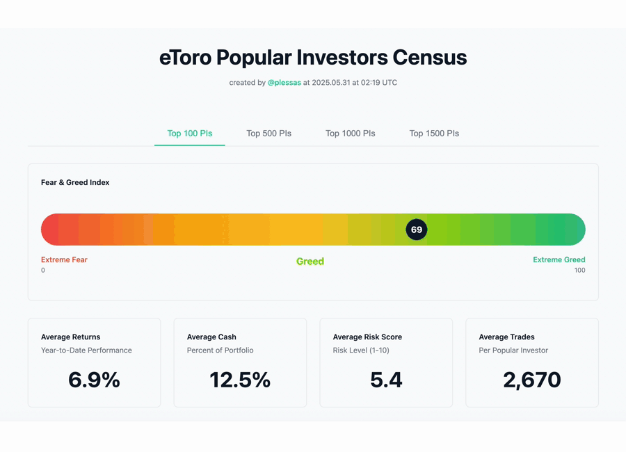

# etoro PI Census

A modern web application for analyzing the portfolios and performance metrics of eToro's most popular investors (PIs). Built with Next.js 15, TypeScript, and Tailwind CSS.



## Features

### 📊 **Comprehensive Analysis**
- **Fear & Greed Index**: Market sentiment based on average cash allocation
- **Portfolio Diversification**: Distribution of unique instruments per portfolio
- **Cash Allocation**: Cash percentage distribution across investors
- **Returns Distribution**: Performance ranges across analyzed investors
- **Risk Score Distribution**: Risk appetite analysis (Conservative, Moderate, Aggressive, Very High Risk)

### 👥 **Most Copied Investors**
- Ranked by number of copiers (social proof)
- Profile pictures and investor details
- Performance metrics (YTD gain, trades count, win ratio, risk score)
- Pagination support (20 per page, unlimited total)

### 🏆 **Top Holdings Analysis**
- Most popular instruments with asset images
- Average allocation percentages
- Ownership statistics across portfolios
- Yesterday, Week-to-Date (WTD), and Month-to-Date (MTD) returns for each instrument
- Color-coded return indicators (green: positive, red: negative, blue: zero)
- Pagination support (20 per page, unlimited total)

### ⚡ **Real-time Progress Tracking**
- Server-Sent Events for live analysis updates
- Detailed progress messages during processing
- Batch processing for optimal performance

## Configuration

### **Investor Selection**
- **Range**: 1-1000 investors (input validation)
- **Default**: 100 investors
- **API Limit**: eToro API caps at ~1,500 investors

### **Performance Periods**
- Year to Date (default)
- Current Month/Quarter
- Last Year/Two Years
- Historical periods (1, 3, 6 months ago)

## Technical Architecture

### **Frontend**
- **Framework**: Next.js 15.2.4 with App Router
- **Language**: TypeScript with strict typing
- **Styling**: Tailwind CSS with Radix UI components
- **Validation**: Zod schemas for data models

### **Backend**
- **API Routes**: Server-side data fetching and processing
- **Streaming**: Server-Sent Events for real-time progress
- **Rate Limiting**: Intelligent batch processing (50 items at a time)
- **Error Handling**: Comprehensive error boundaries and fallbacks

### **eToro API Integration**
- **Authentication**: X-API-KEY, X-USER-KEY, X-REQUEST-ID headers
- **Endpoints**: Popular investors, user portfolios, instrument details
- **Data Models**: Strongly typed interfaces for all API responses

## Project Structure

```
src/
├── app/                          # Next.js App Router
│   ├── api/                     # API routes
│   │   ├── census/             # Main analysis endpoint
│   │   └── census-stream/      # Streaming analysis endpoint
│   ├── globals.css             # Global styles
│   ├── layout.tsx              # Root layout
│   └── page.tsx                # Main dashboard page
├── components/
│   ├── census/                 # Analysis components
│   │   ├── cash-allocation.tsx
│   │   ├── fear-greed-gauge.tsx
│   │   ├── investor-selector.tsx
│   │   ├── portfolio-diversification.tsx
│   │   ├── returns-distribution.tsx
│   │   ├── risk-score-distribution.tsx
│   │   ├── top-holdings.tsx
│   │   └── top-performers.tsx
│   └── ui/                     # Reusable UI components
├── lib/
│   ├── models/                 # TypeScript interfaces
│   │   ├── census.ts          # Analysis data models
│   │   ├── user.ts            # User and investor models
│   │   └── user-portfolio.ts  # Portfolio data models
│   ├── services/              # Business logic
│   │   ├── census-service.ts  # Main analysis service
│   │   ├── instrument-service.ts # Asset data service
│   │   └── user-service.ts    # User data service
│   ├── etoro-api-config.ts    # API configuration
│   └── utils.ts               # Utility functions
└── middleware.ts              # Next.js middleware
```

## Getting Started

### **Prerequisites**
- Node.js 18+ 
- npm/yarn/pnpm
- eToro API credentials

### **Installation**

1. **Clone the repository**
   ```bash
   git clone <repository-url>
   cd etoro_census
   ```

2. **Install dependencies**
   ```bash
   npm install
   ```

3. **Environment setup**
   Create a `.env.local` file:
   ```env
   ETORO_API_BASE_URL=https://www.etoro.com/api/public
   ETORO_API_KEY=your_api_key_here
   ETORO_USER_KEY=your_user_key_here
   ```

4. **Run development server**
   ```bash
   npm run dev
   ```

5. **Open browser**
   Navigate to [http://localhost:3600](http://localhost:3600)

### **Production Build**
```bash
npm run build
npm start
```

## API Integration

### **Required Headers**
- `X-API-KEY`: eToro API authentication key
- `X-USER-KEY`: eToro user-specific key  
- `X-REQUEST-ID`: UUID for request tracking

### **Key Endpoints**
- **Popular Investors**: `/v1/user-info/people/search`
- **User Portfolios**: `/v1/user-info/people/{username}/portfolio/live`
- **Instrument Details**: `/v1/market-data/instruments`
- **Historical Closing Prices**: `/v1/market-data/instruments/history/closing-price`
- **User Details**: `/v1/user-info/people` (for avatars)

## Performance Optimizations

### **Batch Processing**
- **User Details**: 50 users per API call
- **Instruments**: 50 instruments per API call
- **Rate Limiting**: 200ms delays between batches

### **Streaming Analysis**
- Real-time progress updates via Server-Sent Events
- Non-blocking UI during long-running analysis
- Graceful error handling and recovery

### **Data Efficiency**
- Intelligent caching of instrument details
- Minimal API calls through batch processing
- Efficient data structures and algorithms

## Contributing

### **Code Style**
- TypeScript with strict typing
- ESLint and Prettier configuration
- Consistent naming conventions
- Comprehensive error handling

### **Component Guidelines**
- Functional components with hooks
- Props interfaces for all components
- Responsive design with Tailwind CSS
- Accessibility considerations

## License

This project is for educational and analysis purposes. Please ensure compliance with eToro's API terms of service.

## Support

For questions or issues, please check the existing documentation or create an issue in the repository.