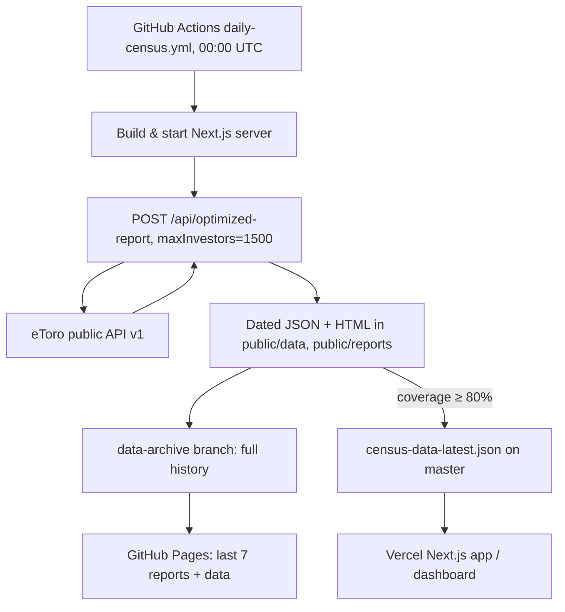

# eToro Popular Investors Census

[](https://github.com/weirdapps/etoro_census/actions/workflows/ci.yml)
[](https://github.com/weirdapps/etoro_census/actions/workflows/daily-census.yml)
[](https://github.com/weirdapps/etoro_census/actions/workflows/codeql.yml)
[](LICENSE)

A Next.js web app plus a GitHub Actions pipeline that takes a daily snapshot of the top 1,500 eToro Popular Investors and turns it into portfolio, sentiment, and performance reports.

Links:

- Daily HTML reports: [weirdapps.github.io/etoro_census](https://weirdapps.github.io/etoro_census)
- Interactive dashboard (Vercel): [etoro-census.vercel.app](https://etoro-census.vercel.app)
- Author's eToro profile: [@plessas](https://www.etoro.com/people/plessas)


## What it does

Every day at 00:00 UTC, a GitHub Actions workflow starts the Next.js server inside the runner, calls its `/api/optimized-report` endpoint, and lets it walk the eToro public API for up to 1,500 Popular Investors. The output is:

1. A dated JSON snapshot (`etoro-data-YYYY-MM-DD-*.json`) committed to the `data-archive` branch.
2. A dated HTML report (`etoro-census-YYYY-MM-DD-*.html`) committed to the same branch and republished on GitHub Pages.
3. A `census-data-latest.json` on `master` that the Vercel Next.js app reads to render the live dashboard.

The Vercel app exposes three views on top of that data:

- `/reports` embeds the latest GitHub Pages report in an iframe.
- `/public` looks up any eToro username and compares that portfolio to the census.
- `/personal` analyses your own portfolio against the census (needs your eToro API keys).

## Features

Grounded in the code under `src/`, `analysis/`, and `.github/workflows/`.

Data collection (`src/lib/services/`, `src/lib/etoro-api-config.ts`):

- Single-pass fetch of investor list, per-investor portfolio, trade info, and instrument metadata.
- Optional Popular Investor feed collection (`includeFeeds: true`).
- Circuit breaker and rate limiter around every eToro call, with 429 back-off and per-request timeout.
- Portfolio coverage gate: the daily workflow only promotes a new `census-data-latest.json` when at least 80% of the top 1,500 investors returned a non-empty portfolio.

Analysis (`src/lib/services/analysis-service.ts` and siblings):

- Fear and greed proxy derived from average cash holdings.
- Portfolio diversification and cash-allocation distributions.
- Return distributions for yesterday, week-to-date, and month-to-date.
- Risk-score distribution and average trades / win-ratio.
- Popular holdings across the cohort with average allocation and recent returns.
- Investor rankings by copiers, with per-investor performance and cash figures.

Streaming API (`src/app/api/optimized-report/route.ts`):

- Server-Sent Events emit `progress`, `error`, and `complete` frames so the workflow log shows phase-by-phase status.
- Optional `API_SECRET_KEY` protects the endpoint via `X-API-KEY` when set.

Public and personal lookups:

- `src/app/api/public/[username]/route.ts` returns a portfolio comparison for any eToro user.
- `src/app/api/personal/route.ts` does the same for the caller's own keys.
- `src/app/api/extract-instruments/route.ts` extracts instrument metadata.

Reporting site:

- Daily HTML report generation lives in `src/lib/report-generator/` (components, scripts, styles).
- GitHub Pages surfaces the last 7 daily reports plus the newest data files (see `.github/workflows/deploy-pages.yml`).

Analysis CLIs (`analysis/`):

- `analysis:daily`, `analysis:weekly`, `analysis:monthly` post generators for the eToro community.
- `analysis/generate-all-posts.ts` runs all three.
- `analysis/collect-feeds.ts` pulls recent posts from top Popular Investors.
- `analysis/hot-hands.js` and `analysis/hot-hands-momentum.js` for winning-streak detection.
- Sub-projects: `analysis/follower-distribution/`, `analysis/performance-comparison/`, `analysis/risk-return/`.

## How it works


```mermaid
flowchart TD
    A[GitHub Actions daily-census.yml, 00:00 UTC] --> B[Build & start Next.js server]
    B --> C[POST /api/optimized-report, maxInvestors=1500]
    C --> D[eToro public API v1]
    D --> C
    C --> E[Dated JSON + HTML in public/data, public/reports]
    E --> F[data-archive branch: full history]
    E -->|coverage ≥ 80%| G[census-data-latest.json on master]
    F --> H[GitHub Pages: last 7 reports + data]
    G --> I[Vercel Next.js app / dashboard]
```

Key modules:

- `src/app/`: Next.js App Router with the home page, `/reports`, `/public`, and `/personal`.
- `src/app/api/`: routes `optimized-report`, `personal`, `public/[username]`, `users`, `extract-instruments`, `health`.
- `src/lib/services/`: data collection, analysis, feeds, instruments, portfolio comparison, historical tracking, alerts.
- `src/lib/etoro-api-config.ts`: eToro endpoint map, rate limiter, circuit breaker.
- `src/lib/schemas/`: Zod schemas for investor, portfolio, instrument, and feed payloads.
- `src/lib/report-generator/`: HTML report assembly.
- `src/lib/supabase/`: optional PostgreSQL sync (see `scripts/sync-daily-to-supabase.js`).
- `analysis/`: standalone TypeScript and JS CLIs for post generation and deeper analytics.
- `scripts/`: sync, compression, and Supabase import utilities.

## Installation

Prerequisites:

- Node.js 22 (matches the CI and daily workflow).
- npm (project uses `package-lock.json`).
- eToro API credentials (`ETORO_API_KEY`, `ETORO_USER_KEY`).

Clone and install:

```bash
git clone git@github.com:weirdapps/etoro_census.git
cd etoro_census
npm install
```

Historical snapshots live on the `data-archive` branch and add up to tens of gigabytes. If you do not need history, use a shallow clone:

```bash
git clone --depth 1 git@github.com:weirdapps/etoro_census.git
```

Create `.env.local` (see `.env.local.example`):

```env
ETORO_API_KEY=your_api_key_here
ETORO_USER_KEY=your_user_key_here
# Optional overrides
# ETORO_API_BASE_URL=https://www.etoro.com/api/public
# API_SECRET_KEY=some_shared_secret
```

## Usage

Development server:

```bash
npm run dev
# open http://localhost:3600
```

Production build:

```bash
npm run build
npm start
# defaults to port 3000, override with PORT=xxxx npm start
```

Generate a census report locally (server must be running):

```bash
curl -X POST http://localhost:3600/api/optimized-report \
  -H "Content-Type: application/json" \
  -d '{"period": "CurrYear", "maxInvestors": 100, "includeFeeds": false}'
```

The endpoint streams Server-Sent Events. `period` accepts `CurrYear`, `CurrMonth`, or `CurrWeek`. `maxInvestors` is capped at 2000 by the schema; the daily workflow uses 1500 (the eToro Popular Investor list cap).

Analysis CLIs:

```bash
npm run analysis:daily     # daily post
npm run analysis:weekly    # weekly summary
npm run analysis:monthly   # monthly summary
npm run analysis:all       # all three
```

Output goes to `analysis/output/` (gitignored). See `analysis/README.md` for details.

Sync the local `public/data/` copy from `data-archive`:

```bash
npm run sync
# or
bash scripts/sync-all-data.sh
```

## Configuration

Environment variables read by the code:

| Variable | Where | Required | Purpose |
|---|---|---|---|
| `ETORO_API_KEY` | `src/lib/etoro-api-config.ts` | Yes | eToro API key header (`X-API-KEY`) |
| `ETORO_USER_KEY` | `src/lib/etoro-api-config.ts` | Yes | eToro user key header (`X-USER-KEY`) |
| `ETORO_API_BASE_URL` | `src/lib/etoro-api-config.ts` | No | Defaults to `https://www.etoro.com/api/public` |
| `API_SECRET_KEY` | `src/lib/auth.ts` | No | If set, `/api/optimized-report` requires `X-API-KEY` on inbound requests |
| `NEXT_PUBLIC_SUPABASE_URL`, `NEXT_PUBLIC_SUPABASE_ANON_KEY` | `src/lib/supabase/client.ts` | No | Enable the optional Supabase historical sync scripts |
| `PORT` | `package.json` (`start`) | No | Production port for `npm start` (default 3000; dev is 3600) |

GitHub Actions secrets used by `.github/workflows/daily-census.yml`:

- `ETORO_API_KEY`, `ETORO_USER_KEY`: credentials for the census fetch.
- `PUSH_PAT`: token used to push to `master` and `data-archive` from the job.
- `VERCEL_DEPLOY_HOOK`: optional, pings Vercel after a successful run.

## Automation

Workflows in `.github/workflows/`:

| File | Trigger | Purpose |
|---|---|---|
| `daily-census.yml` | cron `0 0 * * *` + manual | Full census, archive, coverage gate, Pages/Vercel triggers |
| `deploy-pages.yml` | push to `master` + cron `30 0 * * *` + manual | Publish last 7 reports and data files to GitHub Pages |
| `ci.yml` | push and PRs to `master` | Lint, `tsc --noEmit`, Vitest with coverage, `next build` |
| `codeql.yml` | push and PRs to `master` + weekly | CodeQL scan for JavaScript / TypeScript |
| `sonarcloud.yml` | push and PRs | SonarCloud analysis on public builds when `SONAR_TOKEN` is set |
| `dependabot-auto-merge.yml` | pull_request | Auto-merge patch / minor Dependabot PRs |
| `deps-refresh.yml` | cron `13 5 8 * *` + manual | Monthly dependency refresh via `weirdapps/shared-workflows` |

If the daily census fails, a `notify-failure` job opens or comments on a GitHub issue labelled `census-failure,automated` and, when `SLACK_WEBHOOK_URL` is set, posts a Slack alert.

Do not add a `push` trigger to `daily-census.yml`: the workflow commits back to `master`, and a `push` trigger would loop.

## Data layout

```text
public/data/
  census-data-latest.json      # tracked in master; consumed by the Vercel app
  etoro-data-YYYY-MM-DD-*.json # dated snapshots (synced from data-archive)
public/reports/
  etoro-census-YYYY-MM-DD-*.html # dated HTML reports (synced from data-archive)
archive/                        # optional git worktree pointing at data-archive
  data/*.json
  reports/*.html
```

The `data-archive` branch is the source of truth for historical snapshots. `master` only keeps the latest snapshot so it stays small enough to deploy on Vercel. See `ARCHITECTURE.md` for the full dual-branch design and the local sync recipe.

The `public/` and `archive/` trees together are intentionally large (tens of GB) because the full time series is required for backtesting, trend analysis, and signal validation. Do not trim them; use a shallow clone if you only need code.

## Development

```bash
npm test              # Vitest in watch mode
npm run test:run      # single run
npm run test:coverage # with coverage (v8 provider, html/lcov reports)
npm run lint          # ESLint (flat config)
npx tsc --noEmit      # TypeScript strict check
npm run build         # production Next.js build
```

Vitest configuration lives in `vitest.config.ts`; tests are picked up from `src/**/*.{test,spec}.{ts,tsx}` under a `jsdom` environment. Additional guides:

- `CONTRIBUTING.md` for contribution norms.
- `ARCHITECTURE.md` for the dual-branch data architecture.
- `SECURITY.md` for how to report vulnerabilities.

## Disclaimers

For educational and informational use only. This project is independent and not endorsed by eToro. Data is provided as-is; nothing in this repository is investment advice. Trading involves substantial risk of loss.

## License

MIT, see [LICENSE](LICENSE). Copyright (c) 2026 Dimitris Plessas.
