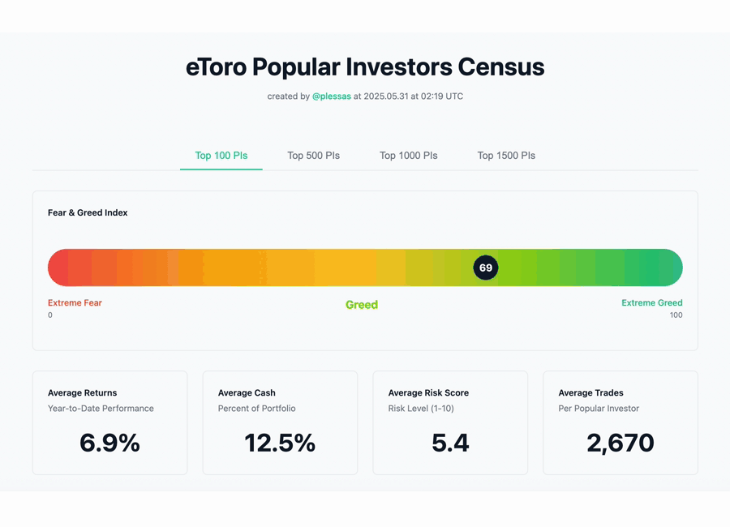

# eToro Popular Investors Census

A web application for analyzing portfolios and performance metrics of eToro's most popular investors. Provides data-driven insights into investor behavior, portfolio composition, and market sentiment across 1,500 popular investors.

<!-- Deployment trigger: 2025-12-07 -->

🔗 **Live Dashboard**: [weirdapps.github.io/etoro_census](https://weirdapps.github.io/etoro_census)
📊 **Vercel Deployment**: [etoro-census.vercel.app](https://etoro-census.vercel.app)
👤 **Author's eToro Profile**: [@plessas](https://www.etoro.com/people/plessas)



## What It Does

This tool analyzes eToro's popular investors to provide:
- Portfolio composition and diversification metrics
- Cash allocation patterns across investors
- Performance distribution analysis
- Risk appetite insights
- Market sentiment indicators

The analysis processes data from up to 1,500 popular investors and generates comprehensive reports with interactive visualizations.

## Key Features

### 📊 Analysis Metrics
- **Fear & Greed Index**: Sentiment indicator based on average cash holdings (30% cash = 0 display, 0% cash = 100 display)
- **Portfolio Diversification**: Distribution of unique instruments across portfolios
- **Cash Allocation**: Cash percentage patterns with risk implications
- **Returns Analysis**: Performance distribution (Yesterday, Week-to-Date, Month-to-Date)
- **Risk Profiles**: Risk score distribution (Conservative to Very High Risk)
- **Trading Activity**: Average trades count and win ratios

### 👥 Investor Rankings
- Ranked by copiers (social proof metric)
- Profile information and performance data
- YTD gains, trade statistics, risk scores
- Cash percentage indicators
- Paginated display (20 per page)

### 🏆 Popular Holdings
- Most common instruments across portfolios
- Average allocation percentages
- Recent performance data (Yesterday/WTD/MTD returns)
- Asset details and ownership statistics
- Color-coded return indicators

### ⚡ Real-Time Processing
- Server-Sent Events for progress updates
- Detailed phase-by-phase status messages
- Handles 1,500 investors efficiently
- Comprehensive error recovery

## Tech Stack

### Frontend
- **Framework**: Next.js 16.2.1 with App Router
- **Language**: TypeScript with strict typing
- **Styling**: Tailwind CSS v4 + Radix UI components
- **Theming**: Dark mode support with next-themes
- **Validation**: Zod schemas
- **Analytics**: Vercel Analytics + Speed Insights
- **Testing**: Vitest with 326+ tests (comprehensive service, schema, and utility coverage)

### Backend
- **API**: RESTful endpoints with streaming support
- **Data Collection**: Single-pass architecture with circuit breakers
- **Resilience**: Circuit breaker pattern with exponential backoff retry
- **Validation**: Zod middleware for request/response validation
- **Logging**: Structured JSON logging (production) / Pretty printing (development)
- **Error Handling**: Adaptive delays and timeout protection
- **Export**: JSON data with comprehensive details

### Infrastructure
- **Deployment**: Vercel (production) + GitHub Pages (reports)
- **Database**: Supabase (PostgreSQL) for historical data
- **Automation**: Daily reports via GitHub Actions (00:00 UTC)
- **Monitoring**: Real-time performance tracking
- **Data Archival**: Gzip compression for historical data (~90% space savings)

## Architecture

### Single-Pass Data Collection
The application uses an optimized data collection strategy:
- One comprehensive API fetch per analysis
- Multiple analysis bands from same dataset (100/500/1000/1500 investors)
- Circuit breakers with adaptive error handling
- 30-second timeouts with graceful fallbacks
- Smart batching (50 items per call)

### Services
- **DataCollectionService**: Handles all API interactions with progress tracking
- **AnalysisService**: Generates insights from collected data
- **InstrumentService**: Manages asset information
- **UserService**: Handles investor data and authentication

## Project Structure

```
src/
├── app/                          # Next.js App Router
│   ├── api/                      # API routes
│   │   ├── optimized-report/    # Main analysis endpoint
│   │   ├── census-stream/       # Streaming analysis
│   │   ├── extract-instruments/ # Instrument utilities
│   │   └── public/[username]/   # Individual investor data
│   ├── v2/                       # V2 interface routes
│   ├── globals.css               # Global styles
│   ├── layout.tsx                # Root layout with analytics
│   └── page.tsx                  # Main dashboard
├── components/
│   ├── analytics.tsx             # Vercel analytics wrapper
│   ├── census/                   # Analysis components
│   │   ├── fear-greed-gauge.tsx
│   │   ├── portfolio-diversification.tsx
│   │   ├── top-holdings.tsx
│   │   └── top-performers.tsx
│   ├── ui/                       # Reusable UI components
│   └── Disclaimer.tsx            # Legal disclaimers
├── lib/
│   ├── models/                   # TypeScript interfaces
│   ├── services/                 # Business logic
│   │   ├── data-collection-service.ts
│   │   ├── analysis-service.ts
│   │   └── user-service.ts
│   ├── etoro-api-config.ts       # API configuration
│   └── utils.ts                  # Utility functions
└── middleware.ts                 # Next.js middleware

analysis/                         # Analysis tools (TypeScript)
├── daily-post.ts                 # Daily census updates
├── weekly-post.ts                # Weekly summaries
├── monthly-post.ts               # Monthly reports
├── generate-all-posts.ts         # Run all post generators
├── collect-feeds.ts              # PI feed collection
├── lib/
│   ├── types.ts                  # Type definitions
│   └── utils.ts                  # Shared utilities
├── hot-hands.js                  # Winning streak analysis
├── export-for-integration.ts     # Data export for integrations
├── follower-distribution/        # Follower analysis tools
├── performance-comparison/       # Performance tools
├── risk-return/                  # Risk/return analysis
└── output/                       # Generated analysis results (gitignored)

scripts/                          # Utility scripts
├── compress-historical-data.js   # Compress old JSON data
├── decompress-for-analysis.js    # Extract compressed data
├── import-historical-to-supabase.js  # Import data to Supabase
└── sync-daily-to-supabase.js     # Sync daily data to Supabase

supabase/                         # Database schema
└── migrations/
    └── 001_initial_schema.sql    # Initial database schema

.github/workflows/                # Automation
├── daily-census.yml              # Daily report generation
└── deploy-pages.yml              # GitHub Pages deployment
```

## Getting Started

### Prerequisites
- Node.js 18+
- npm/yarn/pnpm
- eToro API credentials

### Installation

1. Clone and install:
   ```bash
   git clone <repository-url>
   cd etoro_census
   npm install
   ```

2. Configure environment (`.env.local`):
   ```env
   ETORO_API_BASE_URL=https://www.etoro.com/api/public
   ETORO_API_KEY=your_api_key_here
   ETORO_USER_KEY=your_user_key_here
   ```

3. Run development server:
   ```bash
   npm run dev
   ```
   Navigate to [http://localhost:3600](http://localhost:3600)

### Production Build
```bash
npm run build
npm start
```

## Analysis Tools

### Social Media Post Generators
Generate formatted updates for the eToro community:

```bash
# Using npm scripts (recommended)
npm run analysis:daily
npm run analysis:weekly
npm run analysis:monthly
npm run analysis:all

# Or using tsx directly
npx tsx analysis/daily-post.ts
npx tsx analysis/weekly-post.ts
npx tsx analysis/monthly-post.ts
npx tsx analysis/generate-all-posts.ts
```

Features:
- Unicode sans-serif bold formatting (eToro compatible)
- Copier activity tracking (daily/weekly/monthly gainers/losers)
- Top 100 vs. broad market performance comparisons
- Adaptive insights based on data

### PI Feed Collection
```bash
# Collect recent posts from top Popular Investors
npx tsx analysis/collect-feeds.ts
```

### Performance Analysis
```bash
# Hot hands - investors on winning streaks
node analysis/hot-hands.js

# Momentum-based analysis
node analysis/hot-hands-momentum.js

# Follower distribution charts
cd analysis/follower-distribution
node generate-follower-chart.js
```

### Advanced Analysis
- **Risk vs Return**: Interactive charts (see `analysis/risk-return/README.md`)
- **Performance Comparison**: Outperformance analysis tools
- **Follower Distribution**: Power law analysis across all 1,500 investors

## API Integration

### Authentication Headers
```
X-API-KEY: eToro API authentication key
X-USER-KEY: User-specific authorization
X-REQUEST-ID: UUID for request tracking
```

### Key Endpoints
- Popular Investors: `/v1/user-info/people/search`
- Portfolios: `/v1/user-info/people/{username}/portfolio/live`
- Trade Info: `/v1/user-info/people/{username}/tradeinfo?period=currYear`
- Instruments: `/v1/market-data/instruments`
- Closing Prices: `/v1/market-data/instruments/history/closing-price`
- User Details: `/v1/user-info/people` (avatars, profiles)

## Deployment

### Automated Daily Reports
GitHub Actions workflow runs daily at 00:00 UTC:
- Analyzes all 1,500 popular investors
- Generates HTML reports and JSON data
- Deploys to GitHub Pages
- Triggers Vercel deployment

### Manual Deployment
```bash
# Deploy to Vercel
vercel --prod

# Or push to master branch (auto-deploys)
git push origin master
```

## Configuration

### Investor Selection
- **Range**: 1-1500 investors (validated)
- **Default**: 100 investors
- **API Limit**: eToro caps at exactly 1,500 popular investors

### Performance Periods
- Year to Date (default)
- Current Month/Quarter
- Historical periods (1, 3, 6 months ago)
- Last Year/Two Years

## Performance Optimizations

### Data Collection
- Single-pass collection eliminates redundant API calls
- Circuit breakers prevent cascade failures
- Adaptive delays based on error rates (75ms to 1500ms)
- 30-second timeouts with graceful recovery
- Batch processing (50 items per API call)

### Analysis Generation
- Zero API calls for analysis (uses pre-collected data)
- Multiple investor bands processed simultaneously
- Shared dataset across all analysis types
- Fast processing without network delays

### GitHub Actions
- Disk space optimization (removes unnecessary SDKs)
- Efficient artifact handling (last 7 days of reports)
- Build cache cleanup
- Monitoring and error tracking

## Development

### Code Style
- TypeScript with strict typing
- ESLint + Prettier configuration
- Consistent naming conventions
- Comprehensive error handling

### Component Guidelines
- Functional components with hooks
- Typed props interfaces
- Responsive Tailwind CSS design
- Dark mode support via CSS variables
- Loading skeletons for better UX
- Accessibility considerations

### Testing
```bash
# Run tests
npm test

# Run tests in watch mode
npm test -- --watch

# Run with coverage
npm test -- --coverage
```

Current test coverage: 326+ tests across:
- Services (DataCollectionService, AnalysisService, InstrumentService, UserService, AssetService)
- Schemas (Investor, Instrument, Portfolio - 100% coverage)
- Middleware (Request validation, API response utilities)
- Utilities (Country mapping, formatting)
- API Config (Circuit breaker, retry logic)

### Data Management
```bash
# Compress historical data (7+ days old)
node scripts/compress-historical-data.js

# Decompress data for analysis
node scripts/decompress-for-analysis.js

# Import to Supabase
node scripts/import-historical-to-supabase.js

# Sync daily data
node scripts/sync-daily-to-supabase.js
```

## Known Limitations

- eToro API limit: exactly 1,500 popular investors (hard cap)
- Some investors may have incomplete profile data
- Instrument data availability varies by market hours
- Historical data limited to available closing prices
- Rate limiting handled via circuit breakers

## Disclaimers

**Important**: This project is for educational and informational purposes only.

- **Not Financial Advice**: Does not constitute financial, investment, or trading advice
- **No eToro Affiliation**: Independent project, not endorsed by eToro
- **Data Accuracy**: Provided "as is" without warranties
- **Risk Warning**: Trading involves substantial risk of loss

Always consult with a qualified financial advisor before making investment decisions.

## License

This project is for educational and analysis purposes. Please ensure compliance with eToro's API terms of service.

## Support

For questions or issues:
- Check existing documentation (ARCHITECTURE.md, CONTRIBUTING.md)
- Create an issue in the repository
